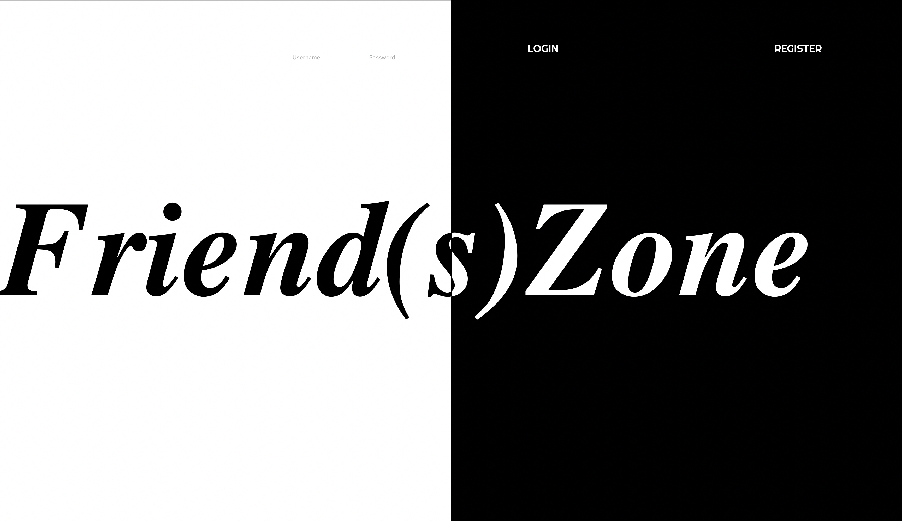

## Baby's First React Project

# Why?
The goal was to showcase what we had learned at DevMountain after our first 7 weeks of learning web development.

# What?
This project was my first attempt at building an Instagram clone.

# How?
This is built with React, Bycrypt, Node, Express, Redux, and Socket.io supported by a SQL database.